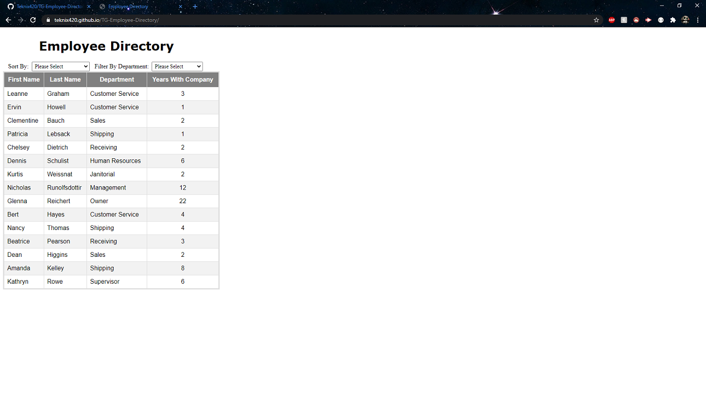
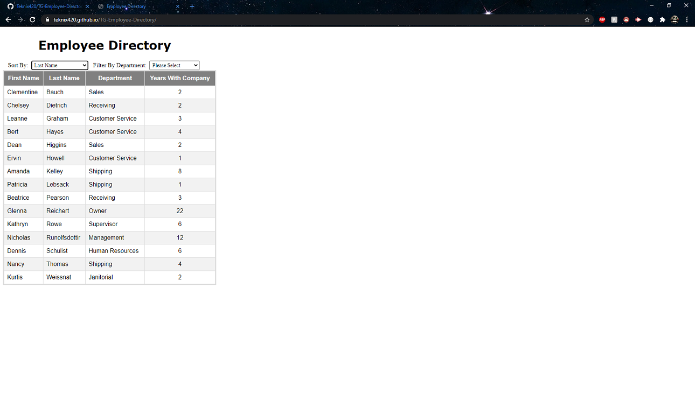
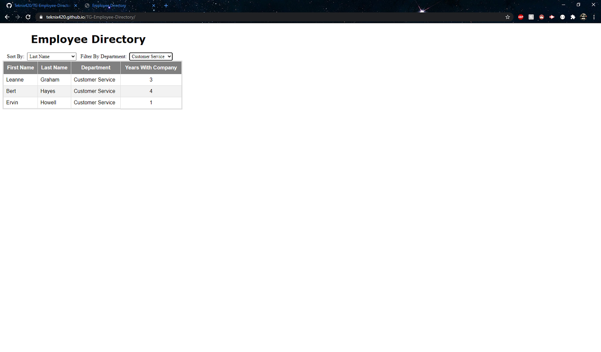
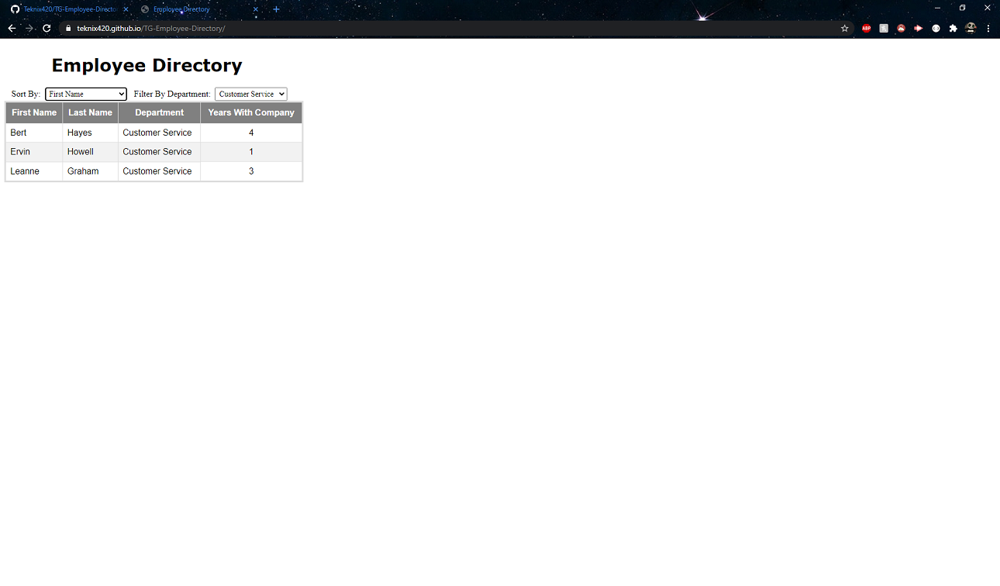

# TG-Employee-Directory
## By Travis Gray

## Introduction

The purpose of this homework is to demonstrate what we have learned in React over the past week by importing and displaying data, and being able to manipulate that data without having to refresh the entire page. In this project, I've created an employee directory with a bunch of dummy employee data in a separate file and then imported the data into my App.jsx file. The data was displayed and I've provided a couple of drop down boxes to manipulate the data by means of filtering and/or sorting.

## Demo

This is the main page when you load the page. It automatically loads all of the employee information into the table and displays it. There's a couple of drop down boxes that will be used to manipulate the data. I've tried to take a screenshot of each drop down but it didn't screen shot the drop downs correctly.

The _Sort By_ drop down contains:
* First Name
* Last Name
* Department
* Years with Company

The _Filter By Department_ contains all of the departments listed in the employee directory. This data is also dynamic so that if any departments are added when more employees are added, the newly added department would be added to this list if it isn't already there. There are no duplicates in this list.

Here, the sort function is demonstrated. Once I select an option from the _Sort By_ drop down box, the list will automatically rearrange to whichever sort function I would like. You can switch through the sort functions without having to reload the page and it will continue rearranging the data.

The filter is then demonstrated by utilizing the drop down box. I only created a department filter but I was thinking about implementing a search function as well. As stated before, the _Filter's_ drop down box contains all of the departments that are currently linked to the employees. If any more departments are added, it will automatically add it to this list. Just a side note, I changed the drop down box so that if a user re-selects the _Please Select_ option, it will remove the filter and display all of the data again; the sort function doesn't work this way though.

And finally, this picture displays the sort function and the filter function both being used in conjunction with one another. A filter is applied first, and then the data is then sorted afterwards.

## Links
* [Github](https://github.com/Teknix420/TG-Employee-Directory)
* [Github Pages](https://teknix420.github.io/TG-Employee-Directory/)